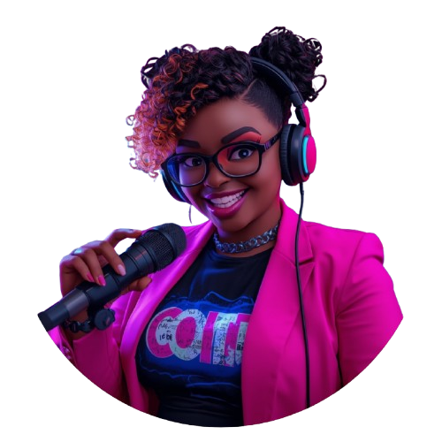
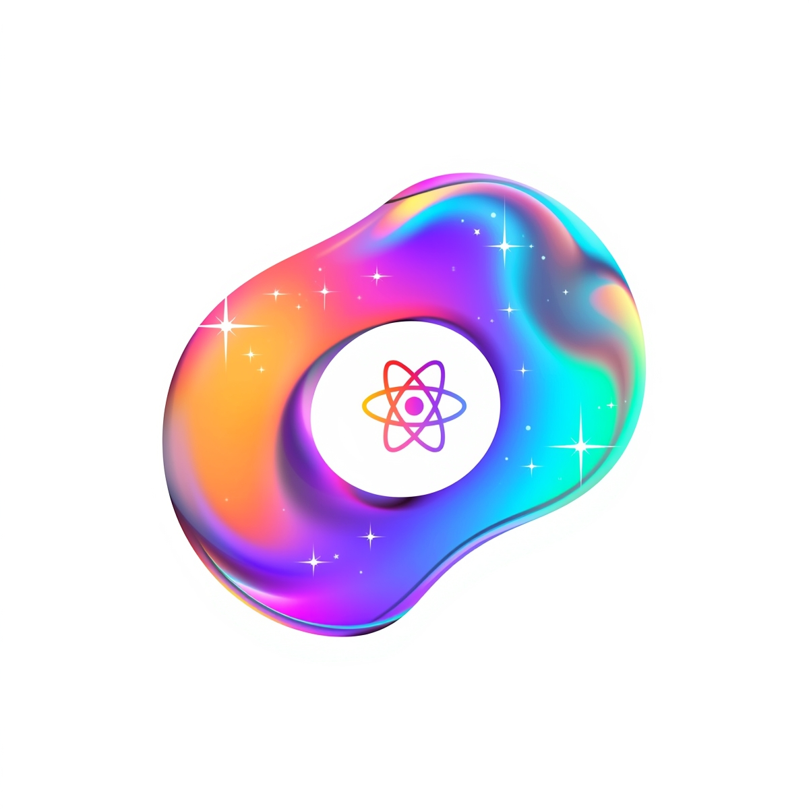

# 🎙PodeCast Console.GAY: A Runway de Componentes 💅

## Visão Geral e Missão 🏳‍🌈🏳‍🌈

O **Console.GAY** é o podcast revolucionário que desmistifica o mundo da programação e da arquitetura de software, traduzindo conceitos complexos (como React, .NET, Tipagem Forte e Performance Assíncrona) para a linguagem pop, vibrante e cheia de *shade* da comunidade LGBTQIA+.

Nossa missão é criar um **algoritmo de familiaridade**, onde o aprendizado de tecnologia seja divertido, empoderador e 100% inclusivo, transformando cada tópico técnico em um desfile de alta costura (uma "Runway de Componentes").

**Nome:** `Console.GAY`
**Slogan:** *Padrões, Performance e o Glow Up do seu Código.*

---

## 👑 A Persona: Lua / Syntaxia Error


No coração do **Console.GAY** está nossa anfitriã, **Lua**, também conhecida como **Syntaxia Error**. Ela é a **Diva do Debugging** e a **CEO do Código**, cuja voz e estilo são a fusão da energia do *Ei Nerd* com a acidez e o *glamour* das Drag Race. A persona foi criada para ser um farol de representatividade e autoridade técnica.

* **Identidade:** Mulher lésbica, negra, bordinha, com atitude e estilo *cyber-queer* (neon pink, preto, cabelo cacheado com pontas loiras).
* **Cabelo:** Cacheado/enrolado, com as pontas loiras – um *look* que é puro estilo e atitude.
* **Estilo Visual:** Inspirado na energia vibrante e expressiva da **Vanellope von Schweetz** (*Detona Ralph*), misturando o lúdico com o *cyberpunk-queer*.
* **Voz:** Uma mistura de energia do Peter Jordan (*Ei Nerd*) com a acidez e o *empowerment* das *Queens* do *Drag Race*.
* **Linguagem:** Repleta de gírias queer, analogias pop e metáforas tech, tornando a programação acessível e divertida.

**Representação Visual da Lua/Syntaxia Error:**

![Lua Syntaxia Error - Host do Console.GAY]
<p>

    <p>&nbsp&nbsp&nbspLua Lima(<br>
</p>
---

## 🛠️ Metodologia de Criação de Conteúdo (Padrões e Curiosidades)

Cada episódio segue uma estrutura rígida, inspirada no ritmo rápido do formato de vídeo-ensaio, para garantir alta retenção e impacto didático.

### ✨ **ESTREIA:** Episódio 1 - REACT: O ALGORITMO DO DÉJÀ-VU!

| Tema Principal | O *Shade* da Lua / O Que Você Aprende | Pilares Focados |
| :---: | :--- | :--- |
| **Componentes: O Exército Reutilizável** | Desvendamos o segredo do **Padrão** React! Aprenda como transformar funções em peças de *montagem* (Componentes) que você **reutiliza** em todo o seu app. É o closet da *Queen* que nunca precisa de uma costura nova! | **Padrão & Familiaridade** |
| **Props: Os Acessórios da Customização** | Como mudar o *look* de um componente sem reescrever o código? As **Props** são os acessórios (dados) que definem o estilo. Entenda o fluxo de dados que garante a **Familiaridade** e a previsibilidade do seu código. | **Familiaridade** |
| **Virtual DOM: A Rainha Mais Rápida** | A **Curiosidade** da performance! Descubra como o React nos engana, usando um *rehearsal* secreto (Virtual DOM) para saber **exatamente** o que atualizar na tela, sem refazer a *montação* inteira. É o segredo para a **Performance** máxima! | **Curiosidade & Performance** |

### 2. Estrutura do Roteiro

| Bloco | Conteúdo | Objetivo |
| :---: | :--- | :--- |
| **Abertura (Gancho)** | Introdução provocativa + Chamada de atenção (`TÁ ERRADA, MIGA!`) | Capturar a audiência nos primeiros 30 segundos. |
| **Pontos de Debate** | Discussão dos 3 tópicos (Componentes, Props, Virtual DOM) usando analogias pop/queer. | Entregar o conteúdo técnico principal com estilo. |
| **Tea-Time: Error Log** | Quadro fixo de solução de *bugs* ou dúvidas dos ouvintes. | Oferecer conselhos práticos e manter a familiaridade. |
| **Fechamento (CTA)** | Reforço da mensagem do episódio + Bordão final. | Engajamento e finalização de alta energia. |

### 3. Integração Visual e Estética (Glow Up)

A estética visual do podcast reflete o tema central: **tecnologia de ponta com cores neon e atitude**.

* **Logotipo/Ícones:** O logo e os ícones de suporte devem ser abstratos e simbólicos, usando a paleta de cores *cyberpunk* (roxo, pink, ciano). O ícone abaixo, inspirado em React, encapsula essa energia.
* **Edição:** Cortes rápidos, gráficos dinâmicos e legendas automáticas (usando IAs como Descript ou CapCut) para manter o ritmo acelerado e o *flow* da Lua.

---
<p>

</p>

## 🎬 Próximos Componentes na *Runway*

* **Episódio 2:** HOOKS: A MAGIA DO `useState` E `useEffect` – Transforme seu Código em uma Diva Reativa.
* **Episódio 3:** GERENCIAMENTO DE ESTADO: ZUSTAND, REDUX E A FOFOCA QUE MOVE O FRONT-END.
* **Episódio 4:** C# E .NET: O CASAL METÓDICO QUE DÁ *SHADE* NA TIPAGEM FRACA DO JAVASCRIPT.

## 👨‍💻 Expert

<p>
    
    <p>&nbsp&nbsp&nbspLua Lima(<br>
    &nbsp&nbsp&nbsp
    <a 
        href="https://github.com/Kitinport1">
        GitHub
    </a>
    &nbsp;|&nbsp;
    <a 
        href="https://www.linkedin.com/in/lauanelima">
        LinkedIn
    </a>
    &nbsp;|&nbsp;
    <a 
        href="https://www.instagram.com/lualimadev/">
        Instagram
    </a>
    &nbsp;|&nbsp;</p>
</p>
<br/><br/>
<p>

---

⌨️ com 🖤 por [Lua Lima](https://github.com/Kitinport1)
```eof